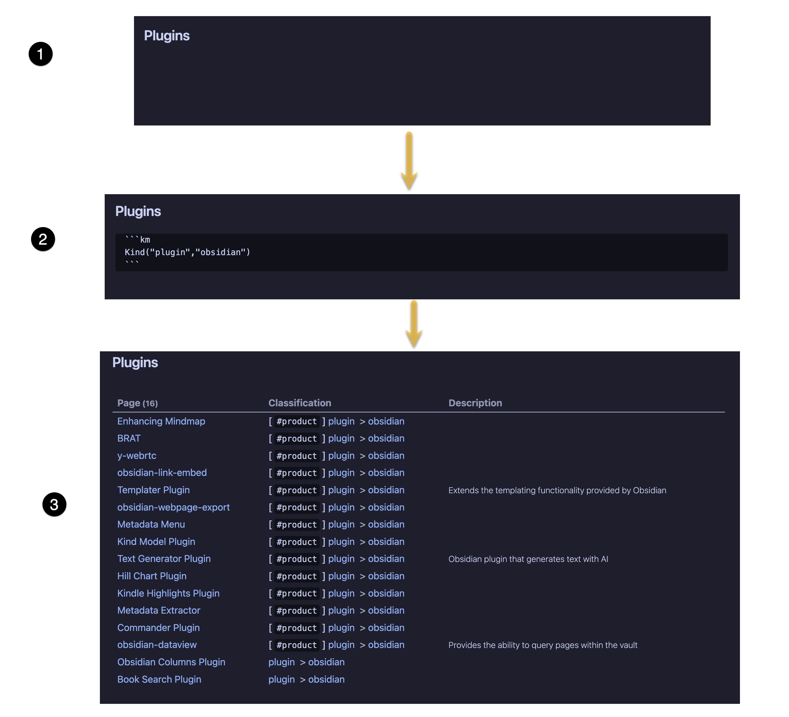
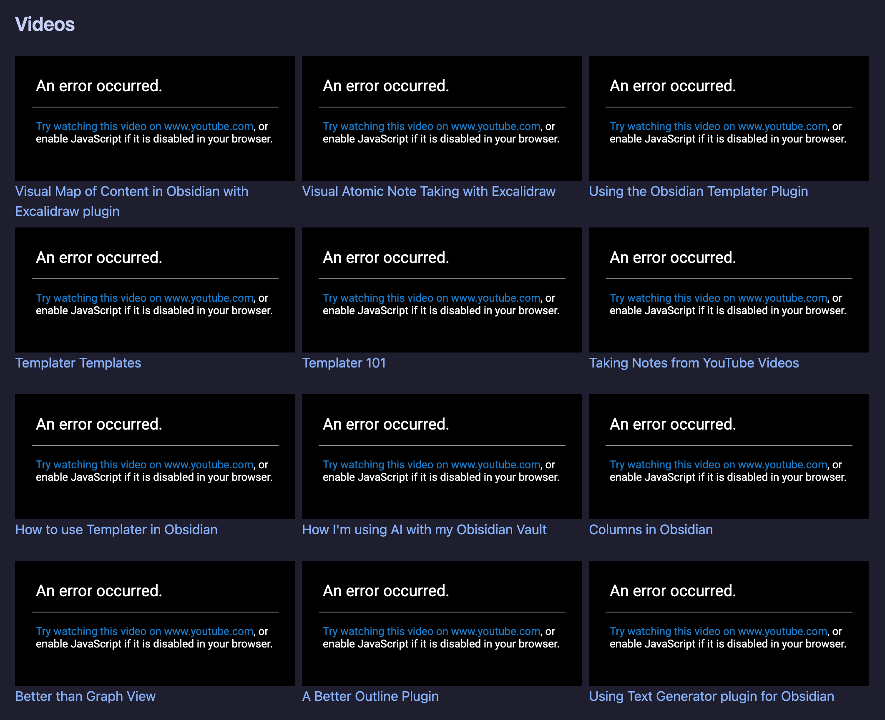
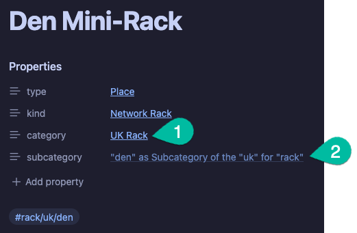
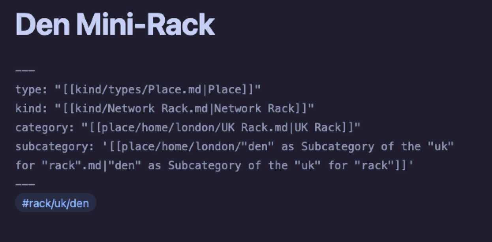
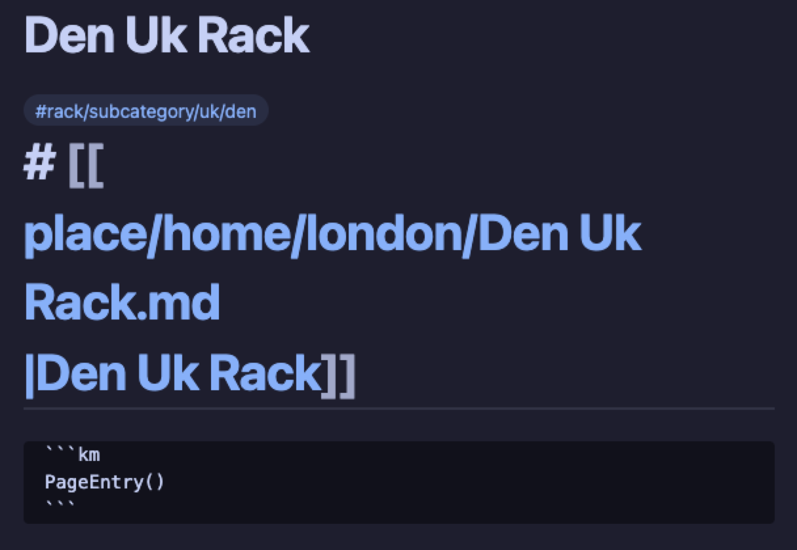
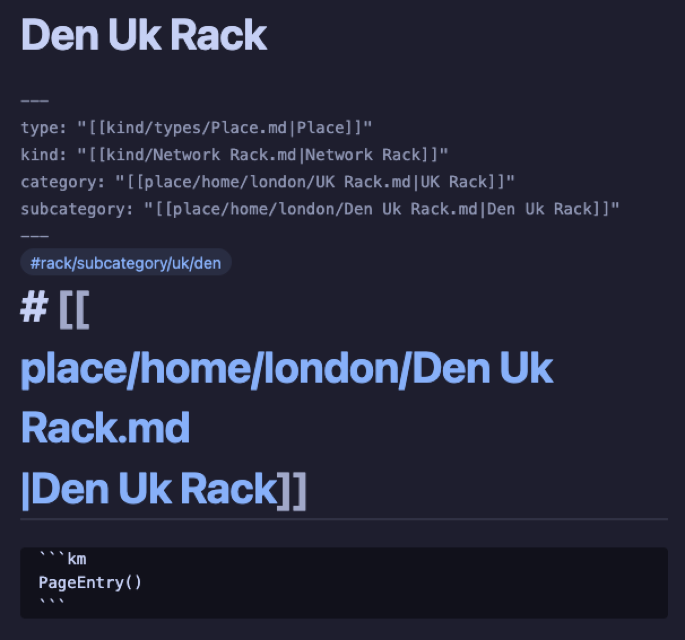
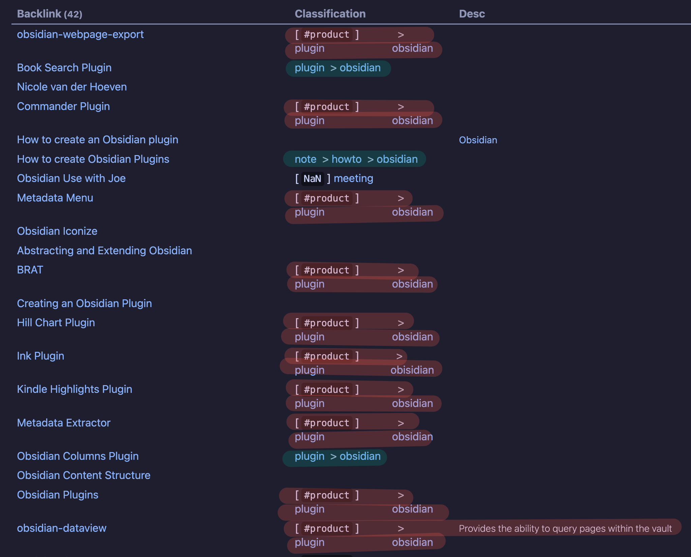
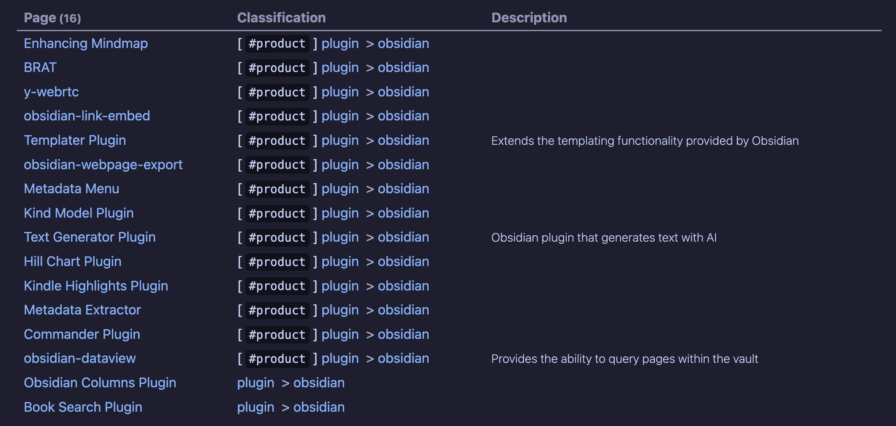

# Known Issues

## Stale Renders

- When opening Obsidian the tabs I had opened re-open but the `km` rendering does not happen
- When i bring the cursor to where the `km` block is it shows up
- When I leave the `km` block then it renders it correctly
- See image below



## Google Video Previews

- I believe Google changed something about the URL's it uses for shareable video links
- In either case, no code has changed and it DID work but now it looks like:




### Actual Code Block Definition

```km
VideoGallery()
```

## Silent Errors


## Future Links for Category / Subcategory Pages

- When you use the `update` command on a page which has a tag like `#kind/category/subcategory`. It will link the category and subcategories to defined category/subcategory's for the given _kind_. However, sometimes the category or subcategory definition doesn't exist yet.
- Obsidian handles "future pages" gracefully and in the case of a category/subcategory page not existing yet we still get a link to a page but we link to a "future page"

  

	In this image above we have two callouts:

	1. The `#rack/uk` mapped successfully to the category definition
	2. The `#rack/uk/den` did not map to a page so we've added a future page link

	

	In the image above we can see the explicit markdown links (and Obsidian based links) that are being defined for the future link. The idea is to provide a **useful** default for the future page. So when a future link is clicked a new page is created:

	

	Now the user can manually run the `update` command to get this:

	

	Regardless of whether the user decides to rename the page to something else we would should always run this `update` to fill in the frontmatter data. 

	**TASK 1:** We should try to automate this but be forewarned there are timing issues which make this more complicated that make this more complicated then you might imagine. 

	**TASK 2:** Beyond the above automation, it would also be really nice to insert the following `km` query into the page:

	#### For a category page

	```km
	Kind("{{kind}}", "{{category}}")
	```

	#### For a subcategory page

	```km
	Kind("{{kind}}", "{{category}}", "{{subcategory}}")
	```

	This will start the page's definition with a listing of the pages which have associated themselves to this category/subcategory. 

## Classification: Formatting and Non-breakable Spaces

In tabular layout, the `classification` column contains a `>` delimited set of values and when the length of the overall string is greater then the width allotted to the column the line is broken up very badly. 

- The ideal is that all spaces be made non-breaking spaces and that with width for this column is given some priority (though if spaces where non-breaking this might auto-correct the width calculation.

### Example of Failing



### Example of Working



### Multi-Classification

- Another related problem is that while we DO WANT to have new lines for each classification associated to a page. As you can see there is a lot of vertical space wasted. Not sure if it's padding or double spaced but we should present it as a single spaced list of items (no bullet point, just meaning that it should be single spaced).


- the picture shows how a page's multiple classification has too much vertical whitespace.

