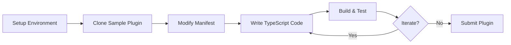

# Obsidian Developer Ecosystem

Obsidian is a powerful knowledge management application built on Electron that provides an extensive developer ecosystem for customization. This guide covers plugin development, theme creation, CSS variables, and the TypeScript API that enables developers to extend Obsidian's functionality.

## Table of Contents

- [Foundation](#foundation)
- [Plugin Development](#plugin-development)
- [Themes](#themes)
- [CSS Variables](#css-variables)
- [TypeScript API](#typescript-api)
- [CodeMirror 6 Integration](#codemirror-6-integration)
- [Platform Considerations](#platform-considerations)
- [Notable Community Plugins](#notable-community-plugins)
- [Quick Reference](#quick-reference)
- [Resources](#resources)

## Foundation

Obsidian's extensibility is built around four core pillars:

1. **Plugins** - TypeScript applications that extend core functionality
2. **Themes** - CSS stylesheets that customize visual appearance
3. **CSS Variables** - A foundation of variables enabling consistent theming
4. **TypeScript API** - Interfaces and classes for programmatic interaction

The ecosystem is vibrant and community-driven, with over 2,696 plugins available. Plugins interact directly with the Obsidian API to register commands, create views, manipulate files, and modify the editor interface.

### Architecture Overview

Obsidian's desktop application runs on Electron (Chromium + Node.js), while the editor uses CodeMirror 6 for the Live Preview experience. This architecture provides:

- Full access to Node.js APIs on desktop
- Rich text editing with WYSIWYG capabilities
- Cross-platform support (desktop and mobile)
- A sandboxed plugin environment with extensive hooks

## Plugin Development

### Anatomy of a Plugin

Every plugin extends the `Plugin` class from the `obsidian` package. The lifecycle is managed via two primary methods:

```typescript
import { Notice, Plugin } from 'obsidian';

export default class HelloWorldPlugin extends Plugin {
  async onload() {
    // Runs when the plugin is enabled
    // Register commands, settings tabs, ribbon icons, event listeners

    this.addRibbonIcon('dice', 'Greet', () => {
      new Notice('Hello, world!');
    });

    this.addCommand({
      id: 'open-greet-modal',
      name: 'Open greet modal',
      callback: () => {
        new GreetModal(this.app).open();
      }
    });

    this.addSettingTab(new SampleSettingTab(this.app, this));
  }

  onunload() {
    // Runs when the plugin is disabled
    // Critical for cleanup to prevent memory leaks
  }
}
```

### Plugin Manifest

The `manifest.json` file contains essential metadata:

```json
{
  "id": "hello-world",
  "name": "Hello world",
  "version": "1.0.0",
  "minAppVersion": "0.15.0",
  "description": "Greets the user",
  "author": "Your Name",
  "authorUrl": "https://your-website.com",
  "fundingUrl": "https://your-funding-page.com",
  "isDesktopOnly": false
}
```

Key considerations:

- The `id` must be unique and should match the folder name
- Always update `minAppVersion` to ensure compatibility
- Set `isDesktopOnly: true` if using Node.js or Electron APIs
- Restart Obsidian after making changes to `manifest.json`

### Development Workflow



1. **Environment Setup**: Install Node.js and Git. Create a dedicated vault for development.

2. **Clone Sample Plugin**:

   ```bash
   cd .obsidian/plugins
   git clone https://github.com/obsidianmd/obsidian-sample-plugin.git
   cd obsidian-sample-plugin
   npm install
   ```

3. **Build Process**:

   ```bash
   npm run dev  # Watch mode with auto-rebuild
   ```

4. **Hot Reloading**: Use the "Hot-Reload" community plugin to automatically refresh your plugin when code changes.

### Plugin Lifecycle and Event Timing

Understanding the plugin lifecycle is crucial for handling initialization correctly:

**onload vs onLayoutReady**: Your plugin's `onload()` is called during startup, before the workspace and vault are fully initialized. For operations requiring the active note or file list:

```typescript
async onload() {
  // Register events and commands here

  // Wait for layout to be ready before accessing files
  this.app.workspace.onLayoutReady(() => {
    // Safe to access vault files and active note
    const files = this.app.vault.getMarkdownFiles();
    const activeView = this.app.workspace.getActiveViewOfType(MarkdownView);
  });
}
```

**Common pitfall**: Do not call `getMarkdownFiles()` directly in `onload()` - the vault may not be indexed yet, resulting in an empty list.

**Event timing distinctions**:

- `editor-change` - User edited text in the editor (immediate)
- `vault.on('modify')` - File saved/modified on disk (delayed)

### Hooks and Extension Points

Obsidian provides extensive hooks for extending behavior:

**Workspace Events**:

```typescript
// Register event handlers (auto-removed on unload)
this.registerEvent(
  this.app.workspace.on('file-open', (file) => {
    console.log(`Opened: ${file?.path}`);
  })
);

this.registerEvent(
  this.app.workspace.on('active-leaf-change', (leaf) => {
    // User switched tabs/notes
  })
);
```

**Vault Events**:

```typescript
this.registerEvent(
  this.app.vault.on('create', (file) => {
    console.log(`Created: ${file.path}`);
  })
);

// Also: 'modify', 'delete', 'rename'
```

**Markdown Processing**:

```typescript
// Post-process rendered markdown in reading mode
this.registerMarkdownPostProcessor((el, ctx) => {
  // Transform rendered HTML
});

// Process specific code block languages
this.registerMarkdownCodeBlockProcessor('dataview', (source, el, ctx) => {
  // Render custom code block
});
```

**UI Injection Points**:

- Commands via `addCommand()` - Command Palette
- Ribbon icons via `addRibbonIcon()` - Left sidebar
- Status bar items via `addStatusBarItem()` - Bottom bar (desktop only)
- Settings tab via `addSettingTab()` - Plugin options
- Custom views via `registerView()` - Kanban boards, graphs, etc.

### Best Practices

1. **Avoid Global App Instance**: Use `this.app` instead of the global `app` object (debugging only).

2. **Prefer Vault API**: Use `this.app.vault.modify()` over the lower-level `Adapter` API. The Vault API handles race conditions and caching safely.

3. **Keep onload Lightweight**: Defer expensive operations until necessary.

4. **Mobile Compatibility**: Avoid Node.js and Electron APIs unavailable on mobile. Be cautious with regex lookbehinds (limited iOS support).

5. **Security**: Avoid `innerHTML`, `outerHTML`, and `insertAdjacentHTML` with user input. Use DOM manipulation methods instead.

6. **Use Registration Methods**: `registerEvent`, `registerInterval`, `registerEditorExtension` - these auto-clean on unload.

## Themes

Themes are CSS stylesheets that override Obsidian's default appearance. They rely on CSS variables for consistency and compatibility.

### Theme Structure

```
my-theme/
  manifest.json
  theme.css
```

**manifest.json**:

```json
{
  "name": "My Theme",
  "version": "1.0.0",
  "author": "Your Name"
}
```

**theme.css**:

```css
body {
  --font-text-theme: Georgia, serif;
}

.theme-dark {
  --background-primary: #18004F;
  --background-secondary: #220070;
}

.theme-light {
  --background-primary: #ECE4FF;
  --background-secondary: #D9C9FF;
}
```

### Theme Development Process

1. Clone the official sample theme:

   ```bash
   cd .obsidian/themes
   git clone https://github.com/obsidianmd/obsidian-sample-theme.git "Sample Theme"
   ```

2. Enable in Settings > Appearance

3. Edit `theme.css` to customize

4. Use Developer Tools (`Ctrl+Shift+I` / `Cmd+Opt+I`) to inspect CSS variables

### Design Philosophy

**Use CSS Variables**: Override built-in variables rather than creating hard-coded styles.

**Low Specificity Selectors**: Use simple class names rather than complex nested selectors. This reduces breakage when Obsidian updates internal DOM structure.

**Local Assets Only**: Community themes cannot load remote assets (fonts, images) for privacy and offline stability. All resources must be bundled or Base64 encoded.

**Avoid `!important`**: This prevents users from overriding styles with snippets.

**Support Both Modes**: Target `.theme-light` and `.theme-dark` body classes.

### Publish Themes

For Obsidian Publish sites, create a `publish.css` file to style your public digital garden differently from your private vault.

## CSS Variables

Obsidian's UI is built on CSS variables, enabling consistent theming across the application.

### Color System

| Category | Purpose | Examples |
|----------|---------|----------|
| Base Colors | Neutral palette | `--color-base-00` (lightest) to `--color-base-100` (darkest) |
| Accent Colors | Interactive elements | `--accent-h`, `--accent-s`, `--accent-l` (HSL) |
| Extended Colors | Status, syntax | `--color-red`, `--color-blue`, `--color-green` |

RGB variants for opacity control:

```css
color: var(--color-red);
background-color: rgba(var(--color-red-rgb), 0.2);
```

### Typography and Spacing

```css
body {
  --font-text-size: 18px;
  --font-interface-theme: -apple-system, BlinkMacSystemFont, "Segoe UI", sans-serif;
  --line-height-normal: 1.5;
}

:root {
  --size-2-1: 0.125rem;
  --size-2-2: 0.25rem;
  --size-4-1: 0.25rem;  /* Spacing units */
  --radius-s: 4px;
  --radius-m: 8px;
}
```

### Foundational Variables

**Colors**:

- `--background-primary`, `--background-secondary`
- `--text-normal`, `--text-muted`

**Typography**:

- `--font-text` (editor), `--font-interface` (UI), `--font-monospace`

**Editor/Code**:

- `--code-background`, `--code-comment`, `--code-function`, `--code-string`

**UI Elements**:

- `--ribbon-background`, `--tab-text-color`, `--status-bar-background`

### Component Variables

```css
:root {
  --input-focus-border-color: Highlight;
  --input-hover-border-color: black;
  --checkbox-radius: 4px;
  --toggle-thumb-width: 16px;
  --list-indent: 2em;
  --list-marker-color: var(--text-muted);
}
```

### Plugin Styling Best Practices

When rendering custom HTML in plugins:

```css
/* Use CSS variables for theme compatibility */
.myplugin-warning {
  color: var(--text-normal);
  background-color: var(--background-modifier-error);
}
```

- Use theme classes like `markdown-preview-view` for inherited styles
- Avoid inline styles in JavaScript
- Add CSS classes and define styles in your plugin's stylesheet
- Use Lucide icons (Obsidian's icon set) via `addRibbonIcon`

## TypeScript API

The Obsidian API provides interfaces and classes for programmatic interaction with the application.

### Core Classes

| Class | Purpose | Access |
|-------|---------|--------|
| `App` | Central hub | `this.app` |
| `Vault` | File CRUD operations | `this.app.vault` |
| `Workspace` | UI layout management | `this.app.workspace` |
| `MetadataCache` | Note metadata access | `this.app.metadataCache` |
| `FileManager` | Safe file operations | `this.app.fileManager` |

### App Instance

```typescript
// Access via this.app in your plugin
const vault = this.app.vault;
const workspace = this.app.workspace;
const metadataCache = this.app.metadataCache;
const fileManager = this.app.fileManager;
```

### Vault Operations

```typescript
// Create file
await this.app.vault.create('path/to/file.md', 'content');

// Read file
const content = await this.app.vault.read(file);

// Modify file
await this.app.vault.modify(file, 'new content');

// Delete file
await this.app.vault.delete(file);

// Rename file
await this.app.vault.rename(file, 'new/path.md');

// Safe read-modify-write
await this.app.vault.process(file, (content) => {
  return content.replace('old', 'new');
});
```

### Workspace Operations

```typescript
// Get active view
const view = this.app.workspace.getActiveViewOfType(MarkdownView);

// Open file
await this.app.workspace.openLinkText('note-name', '', false);

// Get/create leaf (tab)
const leaf = this.app.workspace.getLeaf(true); // new tab

// Register custom view
this.registerView('my-view', (leaf) => new MyView(leaf));
```

### FileManager

Specialized for operations affecting links or frontmatter:

```typescript
// Process frontmatter safely
await this.app.fileManager.processFrontMatter(file, (frontmatter) => {
  frontmatter.tags = ['new-tag'];
});

// Rename with link updates
await this.app.fileManager.renameFile(file, 'new-path.md');
```

### UI Components

**Commands**:

```typescript
this.addCommand({
  id: 'my-command',
  name: 'My Command',
  callback: () => { /* action */ },
  // Or for editor-specific commands:
  editorCallback: (editor, view) => { /* action */ }
});
```

**Notices (Toast Messages)**:

```typescript
new Notice('Operation complete!');
new Notice('Error occurred', 5000); // 5 second duration
```

**Modals**:

```typescript
class MyModal extends Modal {
  constructor(app: App) {
    super(app);
  }

  onOpen() {
    const { contentEl } = this;
    contentEl.setText('Hello!');
  }

  onClose() {
    const { contentEl } = this;
    contentEl.empty();
  }
}

// Usage
new MyModal(this.app).open();
```

**Settings Tab**:

```typescript
class MySettingTab extends PluginSettingTab {
  display(): void {
    const { containerEl } = this;
    containerEl.empty();

    new Setting(containerEl)
      .setName('Setting name')
      .setDesc('Setting description')
      .addText(text => text
        .setPlaceholder('Enter value')
        .setValue(this.plugin.settings.myValue)
        .onChange(async (value) => {
          this.plugin.settings.myValue = value;
          await this.plugin.saveSettings();
        }));
  }
}
```

### Event Handling

```typescript
// Workspace events
this.registerEvent(
  this.app.workspace.on('file-open', (file) => { })
);

this.registerEvent(
  this.app.workspace.on('active-leaf-change', (leaf) => { })
);

this.registerEvent(
  this.app.workspace.on('editor-change', (editor) => { })
);

// Vault events
this.registerEvent(
  this.app.vault.on('create', (file) => { })
);

this.registerEvent(
  this.app.vault.on('modify', (file) => { })
);

// DOM events (auto-cleaned)
this.registerDomEvent(document, 'keydown', (evt) => { });
```

### Data Persistence

```typescript
// Save plugin data
await this.saveData({ setting1: 'value' });

// Load plugin data
const data = await this.loadData();
```

## CodeMirror 6 Integration

Obsidian's Live Preview editor is built on CodeMirror 6 (CM6), a modular, extensible code editor library.

### Extension Types

**StateField**: Defines extra state in the editor (decorations, computed info):

```typescript
const myField = StateField.define({
  create() { return Decoration.none; },
  update(value, tr) {
    // Return updated decorations
    return value;
  },
  provide: f => EditorView.decorations.from(f)
});
```

**ViewPlugin**: Responds to editor events and viewport changes:

```typescript
const myPlugin = ViewPlugin.fromClass(class {
  decorations: DecorationSet;

  constructor(view: EditorView) {
    this.decorations = this.buildDecorations(view);
  }

  update(update: ViewUpdate) {
    if (update.docChanged || update.viewportChanged) {
      this.decorations = this.buildDecorations(update.view);
    }
  }

  buildDecorations(view: EditorView): DecorationSet {
    // Build and return decorations
    return Decoration.none;
  }
}, {
  decorations: v => v.decorations
});
```

### Registering Extensions

**Critical**: Do not bundle your own `@codemirror/*` libraries. Mark them as external in your build config and import from Obsidian's provided copy:

```typescript
// In your plugin
this.registerEditorExtension(myExtension);
```

```javascript
// esbuild config - mark as external
{
  external: [
    'obsidian',
    '@codemirror/state',
    '@codemirror/view',
    '@codemirror/language',
    // ... other @codemirror packages
  ]
}
```

### Accessing Obsidian Context from CM6

Obsidian exposes special fields to access its context from within extensions:

```typescript
import { editorViewField, editorEditorField } from 'obsidian';

// Inside your extension
const obsidianView = state.field(editorViewField); // MarkdownView
const editorView = state.field(editorEditorField); // EditorView
```

### Built-in CM6 Components

Obsidian includes many CM6 extensions:

| Component | Description |
|-----------|-------------|
| Markdown Syntax Highlighting | Tokenizes and highlights Markdown |
| Live Preview StateField | Hides/reveals syntax on cursor focus |
| Widget Decorations | Images, checkboxes, LaTeX, callouts |
| Auto-pairing | `**`, `==`, `%%`, brackets |
| Bracket Matching | Highlights matching pairs |
| Folding | Collapse headings and lists |
| Spellcheck | OS-level spell checking |
| Search/Replace | Find dialog and highlights |

**Live Preview Magic**: A StateField provides replace decorations to hide Markdown syntax (like `**` in bold text). When the cursor enters that region, decorations are removed to reveal raw syntax for editing.

### EditorSuggest for Autocomplete

Obsidian provides `EditorSuggest` for custom autocomplete:

```typescript
class MySuggest extends EditorSuggest<string> {
  onTrigger(cursor: EditorPosition, editor: Editor): EditorSuggestTriggerInfo | null {
    // Return trigger info if your syntax is detected
    return null;
  }

  getSuggestions(context: EditorSuggestContext): string[] {
    return ['suggestion1', 'suggestion2'];
  }

  renderSuggestion(value: string, el: HTMLElement): void {
    el.setText(value);
  }

  selectSuggestion(value: string, evt: MouseEvent | KeyboardEvent): void {
    // Insert the selected suggestion
  }
}

// Register
this.registerEditorSuggest(new MySuggest(this.app));
```

## Platform Considerations

### Desktop (Electron)

On desktop, plugins have access to Node.js and Electron modules:

```typescript
import { shell } from 'electron';

// Open external link
shell.openExternal('https://example.com');

// Node.js fs (for files outside vault)
import * as fs from 'fs';
```

**Cautions**:

- Use Vault API for files inside the vault (ensures metadata consistency)
- Node `fs` only for files outside the vault
- Handle OS-specific paths with the `path` module

### Mobile

Mobile apps use a Capacitor-like environment without Node.js:

- No `fs`, `child_process`, or Electron APIs
- Set `isDesktopOnly: true` in manifest if using Node-specific calls
- No hover events (provide touch alternatives)
- No status bar or ribbon bar on phones

```typescript
import { Platform } from 'obsidian';

if (!Platform.isMobile) {
  // Desktop-only code
}
```

### Multiple Windows

Obsidian supports popping notes into new windows. Each window runs plugins:

- Avoid global singletons
- Modals attach to `this.app` instance (window-specific)

### Resource Management

- Long-running tasks freeze the UI
- Use `requestAnimationFrame` for heavy operations
- Consider debouncing for frequent events

## Notable Community Plugins

These plugins demonstrate advanced techniques worth studying:

### Templater

Advanced templating with JavaScript execution:

- Arbitrary JS in templates via `<% code %>`
- Auto-apply templates on file creation
- Uses vault `create` event to detect new files

**Key pattern**: Sandboxed code execution with exposed utilities (`tp` object).

### Dataview

Treat your vault as a queryable database:

- Indexes all files using `metadataCache` events
- Custom query language (DQL) with parser
- Live query results via `registerMarkdownCodeBlockProcessor`

**Key pattern**: Code block processor that renders dynamic content.

### Metadata Menu

Enhanced metadata editing:

- Context menu integration via `file-menu` and `editor-menu` events
- Field type definitions with validation
- Modal-based editing UI

**Key pattern**: Menu event hooks for contextual actions.

### Excalidraw

Drawing and diagramming:

- Custom view type for `.excalidraw` files
- Integrates React component in `ItemView`
- Protocol handler for Obsidian links in drawings

**Key pattern**: External library integration with custom file format.

### Kanban

Interactive Kanban boards:

- Markdown-based storage format
- Drag-and-drop with state synchronization
- Custom view with file persistence

**Key pattern**: Bidirectional sync between UI state and file content.

## Quick Reference

### Common Operations

| Task | Code |
|------|------|
| Show notification | `new Notice('Message')` |
| Get active file | `this.app.workspace.getActiveFile()` |
| Read file | `await this.app.vault.read(file)` |
| Modify file | `await this.app.vault.modify(file, content)` |
| Get all markdown files | `this.app.vault.getMarkdownFiles()` |
| Open file | `await this.app.workspace.openLinkText(path, '')` |
| Add command | `this.addCommand({ id, name, callback })` |
| Add ribbon icon | `this.addRibbonIcon(icon, title, callback)` |
| Register event | `this.registerEvent(this.app.vault.on(...))` |

### Event Reference

| Event | Source | Trigger |
|-------|--------|---------|
| `file-open` | workspace | Active file changes |
| `active-leaf-change` | workspace | Tab switch |
| `editor-change` | workspace | Editor content modified |
| `layout-change` | workspace | Panes resized |
| `create` | vault | File created |
| `modify` | vault | File saved |
| `delete` | vault | File deleted |
| `rename` | vault | File renamed |

### CSS Variable Categories

| Category | Example Variables |
|----------|-------------------|
| Background | `--background-primary`, `--background-secondary` |
| Text | `--text-normal`, `--text-muted`, `--text-accent` |
| Accent | `--accent-h`, `--accent-s`, `--accent-l` |
| Typography | `--font-text`, `--font-interface`, `--font-monospace` |
| Spacing | `--size-4-1`, `--size-4-2`, `--radius-s` |
| Code | `--code-background`, `--code-comment` |

## Resources

### Official Documentation

- [Obsidian Developer Documentation](https://docs.obsidian.md/Home)
- [Sample Plugin Repository](https://github.com/obsidianmd/obsidian-sample-plugin)
- [Sample Theme Repository](https://github.com/obsidianmd/obsidian-sample-theme)

### Community Resources

- [Marcus Olsson's Plugin Docs](https://marcus.se.net/obsidian-plugin-docs) - Comprehensive unofficial guide
- [Obsidian Hub](https://publish.obsidian.md/hub) - Community guides and resources
- [CodeMirror 6 Documentation](https://codemirror.net/) - Editor library docs

### Learning Materials

- Liam Cain's Obsidian API FAQ - Common pitfalls and solutions
- "How to Update Plugins for Live Preview" - Obsidian Hub migration guide
- CodeMirror 6 System Guide - Understanding CM6 architecture

### Community

- Obsidian Discord (Developer channel)
- Obsidian Forum (Developers & API section)
- GitHub discussions on popular plugin repositories
