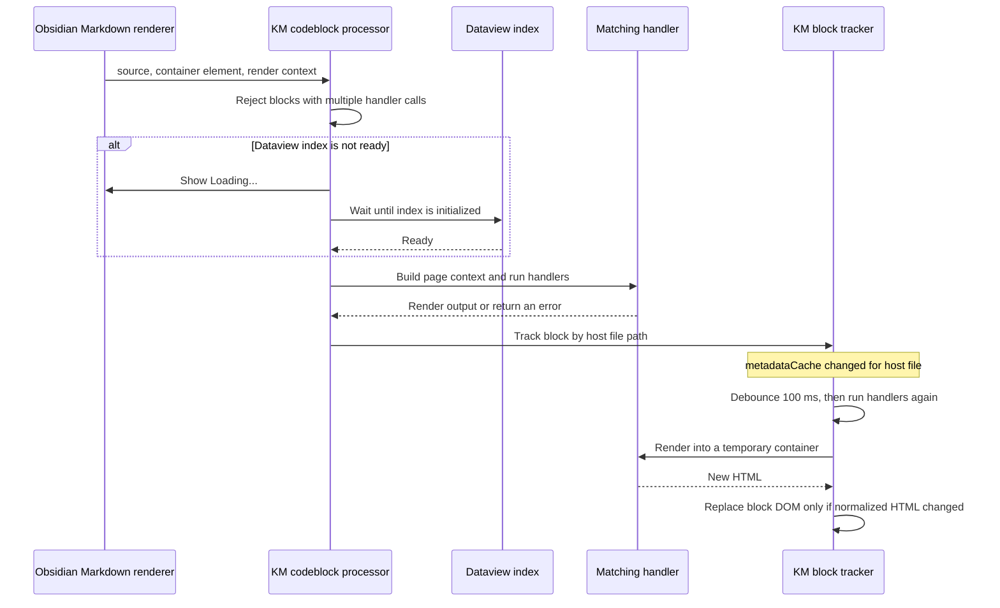

# How `km` Code Blocks Render

Kind Model (KM) handles fenced Markdown code blocks whose language is `km`. A block contains one KM handler call, such as `BackLinks()`. Obsidian passes the block to the plugin, the plugin builds page context and runs the matching handler, and the handler renders into the block's container. The file containing the block is called its **host file** below. KM uses Dataview to look up indexed page metadata.

This document describes the current render path, automatic refresh behavior, and where the data comes from.

## A Typical Block

For example, this block lists pages that link to the page containing it:

````md
```km
BackLinks({ exclude: "software", dedupe: true })
```
````

`exclude` removes backlinks whose pages have the `software` kind. `dedupe` removes backlinks that the current page already links to. Both options are validated by the `BackLinks` handler; its defaults also enable both deduplication and exclusion of backlinks found only in completed tasks.

## Render Lifecycle



### Initial processing

1. During plugin startup, `codeblockParser` registers an Obsidian Markdown code block processor for the `km` language. It sets the processor sort order to `-100`.
2. Obsidian calls the processor with the block's source text, an HTML container, and a `MarkdownPostProcessorContext`. The context identifies the source file and exposes section information.
3. The processor sets horizontal overflow on the container. If it detects more than one handler invocation in the source, it renders an error callout and stops.
4. If Dataview's index is not initialized, the processor shows `Loading...` and queues the block until the plugin detects that Dataview is ready. Otherwise it continues immediately.
5. The plugin creates the handler functions for the block and calls them in sequence. Each handler checks whether its name matches the block. The matching handler uses `getPageInfoBlock()` to look up the host page and adds the block source, container, Obsidian context, section information, and render API to that page data.
6. The matching handler renders its result. If no handler succeeds, KM renders an error callout; an unknown handler also gets suggestions. After processing, KM registers the block with `KmBlockTracker` for refreshes.

### Automatic refresh

At startup, the plugin subscribes to Obsidian's `metadataCache` `changed` event. When Obsidian emits this event for a file, the tracker schedules refreshes for KM blocks registered to that same file path:

1. A new event for the same path resets that path's 100 ms debounce timer.
2. The tracker skips blocks whose container has been detached from the document.
3. It runs each remaining block's saved source again into a temporary container.
4. It normalizes both HTML strings by removing `data-*` attributes and collapsing whitespace. If the normalized strings differ, it replaces the block's children with the newly rendered children. Otherwise it leaves the existing DOM in place.
5. A `MarkdownRenderChild` registered with the block's Obsidian context removes the block from tracking when that rendered element is unloaded. Plugin unload also clears the tracker and pending timers.

The tracker refreshes blocks in the file named by the `changed` event. It does not subscribe to every file that might link to a block's host page. Therefore, a change to another page can affect backlink data without directly triggering refresh of the current page's block.

## Data Freshness

KM combines Obsidian's metadata cache with Dataview's page index. These sources update on their own schedules:

| Source | Used for | Freshness behavior |
| --- | --- | --- |
| Obsidian `MetadataCache` | Resolved links from a file, through `obApp.resolvedLinksFor(path)` | The tracker reacts to Obsidian's `changed` event for that file and waits 100 ms before rendering again. |
| Dataview page index | Page fields such as `inlinks`, `outlinks`, and task references used to build `PageInfo` | Dataview maintains this index independently; it may not reflect a recent edit as soon as Obsidian's metadata cache does. |

For `BackLinks`, `page.inlinks` supplies the list of backlinks, so that list follows Dataview's index freshness. The default `dedupe` filter separately reads `obApp.resolvedLinksFor(page.path)` and removes backlinks that are already outgoing links from the current page. This direct MetadataCache lookup avoids using Dataview's potentially older outgoing-link list for that filter.

For example, if the current page already links to `Projects/Atlas`, `BackLinks()` can omit `Projects/Atlas` from the backlink results when `dedupe` is enabled. If a different file is edited to link to the current page, Dataview must first update its `inlinks` data; the tracker does not refresh this page's block solely because that other file changed.

## BackLinks Filter Order

The `BackLinks` handler applies these filters in order before rendering its table:

1. Remove self-references.
2. Apply `ignoreTags`, if supplied.
3. Apply `dedupe` (enabled by default), using the current page's resolved links from Obsidian's MetadataCache.
4. Apply `exclude` classifications, if supplied. Each candidate page is inspected through Kind Model's page-info API.
5. Apply `excludeCompletedTasks` (enabled by default), using task references from the page data.

If all backlinks are filtered out, the no-results message can list which filters removed links. If filtering takes longer than 100 ms, the handler also writes a warning to the plugin log.

## Practical Notes

- A KM block is processed when Obsidian invokes its Markdown code block processor, and it is reprocessed when Obsidian emits `metadataCache.changed` for its host file.
- The 100 ms delay is a debounce, not a guarantee that Dataview has finished refreshing its index.
- Re-rendering a block does not guarantee fresh backlinks if the relevant Dataview index has not updated yet.
- If a block shows an error, check the handler name and options in the rendered callout. In debug log mode, KM also includes a stack trace for handler errors.

## Implementation References

- [`src/events/codeblockParser.ts`](../src/events/codeblockParser.ts) registers and processes `km` blocks.
- [`src/events/km-block-refresh.ts`](../src/events/km-block-refresh.ts) tracks block containers and handles debounced refresh.
- [`src/page/getPageBlock.ts`](../src/page/getPageBlock.ts) builds the page context supplied to a handler.
- [`src/handlers/BackLinks.ts`](../src/handlers/BackLinks.ts) shows the backlink filters and their data sources.
- [`src/main.ts`](../src/main.ts) sets up the tracker and parser during plugin startup and clears the tracker on unload.
