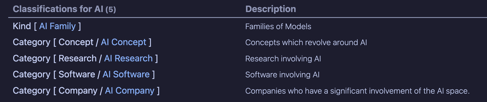

# Types

A **Type** groups related **Kinds**, or a selected **Category** within a Kind. For example, a `product` Type can group the `software`, `hardware`, and `service` Kinds. A Type can also group only AI-related pages from several Kinds by assigning the Type to their AI categories.

Types are represented by tagged Markdown pages. Kind Model uses the tag and frontmatter links to find a page's Type and, when there is a single Kind, expose it through the `type` property. See [Kinded pages](./page-types/kinded-page.md) for how Kind tags classify individual pages.

## Define a Type

Create a dedicated page and add a tag in the form `#type/<name>`. The tag identifies the Type; the page title can be more readable than the tag.

For example, `Product.md` can contain:

```md
# Product

Groups products tracked in this vault.

#type/product
```

Use a distinct Type page for each Type. Keep Type definition pages separate from Kind and Category definition pages, since those classification tags determine how Kind Model interprets a page.

## Assign a Type to a Kind

To make every page of a Kind belong to a Type, put both definition tags on the Kind definition page. For example, the `Software` Kind can use:

```md
# Software

#kind/software #type/product
```

You can also store the Type page as a `type` frontmatter link:

```yaml
type: "[[Product]]"
```

Run the plugin's [Update command](./commands/update-command.md) on the Kind definition page to write the resolved Type link into frontmatter. Kinded pages can then inherit that link from their Kind. When reading a page, an existing `type` link takes precedence over a local Type tag. On Kind and Category definition pages, Update also processes a local Type tag and can replace the frontmatter link with the Type named by that tag, so keep both values aligned.

The `#type/...` tag also lets the Type page's `Children()` query find this Kind definition. A frontmatter link alone sets the relationship used by the page API, but the current `Children()` query discovers definitions by their Type tag.

## Assign a Type to selected Categories

To assign a Type through a Category, put its Type tag on the Category definition page. Pages inherit that Type when their Kind does not already have a Type link. For example, an AI category in the `software` Kind can use:

```md
# AI software

#software/category/ai #type/ai
```

Run Update on the Category definition page to store its Type link. A page classified under that Category can inherit this Type if its Kind has no Type link. When both the Kind and Category definitions have Type links, the Kind's Type takes precedence for ordinary pages in the Category. A direct `#type/...` tag or `type` link on an individual page takes precedence over either inherited value.

This is useful when one Type spans categories from several Kinds that do not already have their own Type links. For example, an `ai` Type might include the `ai` Categories of `software`, `concept`, and `standard`, without assigning every page in those Kinds to AI.

## How pages resolve their Type

For a page with one Kind, Kind Model checks these sources in order:

1. Its own `type` frontmatter link.
2. A `#type/...` tag on the page.
3. The Type link on its Kind definition.
4. The Type link on its Category definition, when the page is associated with a Category.

The Update command writes the resolved Type as a frontmatter link. A direct `#type/...` tag on an individual page is supported, but putting the tag on a Kind or Category definition usually makes the relationship easier to maintain across pages.

A page with multiple Kinds uses the `types` property, which contains links to Type pages. Kind Model resolves it from an existing `types` frontmatter property, direct Type tags, or the Types linked from the page's Kinds. Update writes the result to `types` and removes a singular `type` property. If only one of the page's Kinds has a Type, `types` can contain just that one Type.

Example for a page assigned to two Kinds whose definitions belong to Product and Service:

```yaml
kinds:
  - "[[Software]]"
  - "[[Consulting]]"
types:
  - "[[Product]]"
  - "[[Service]]"
```

## View a Type's definitions

On a Type definition page, add this `km` code block:

````md
```km
Children()
```
````

`Children()` lists Kind definition pages and Category definition pages carrying that Type's `#type/...` tag. It does not list every ordinary page that inherits the Type, and Type tags stored only as frontmatter links are not used by this query.

For example, if `#type/ai` appears on the `AI Family` Kind definition and on Category definitions for `concept`, `research`, and `software`, the table lists those four definitions:



The current `Children()` query does not list subcategory definitions. Pages can resolve a Type from a direct `#type/...` tag, including on a subcategory-classified page, but they do not inherit a Type from a subcategory definition. Assign a Type to a Kind or Category when you want its classified pages to inherit that Type.
